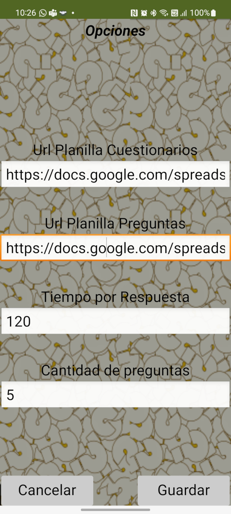
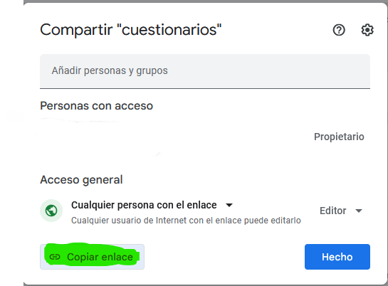

#Configuración

En la pantalla de opciones 

Veremos 4 campos:

* **Url Planilla Cuestionarios:** Este campo contiene la dirección a la planilla que contiene los cuestionarios. 
* **Url Planilla Preguntas:** Este campo contiene la dirección a la planilla que contiene las preguntas de los cuestionarios. 
* **Tiempo por Cuestionario:** Es el tiempo que se tiene para poder responder todo el cuestionario. Una vez que el tiempo haya transcurrido el cuestionario para a la etapa de finalización.
* **Cantidad de preguntas:** Un cuestionario puede estar compuesto por 100 preguntas, si el valor que se carga aca es 0 se van a presentar al usuario todas las preguntas del cuestionario, en nuestro ejemplo serían 100. Si se elije un nuemero mayor a 0 solo se tomaran esa cantidad de preguntas. Si el número es mayor a la cantidad de preguntas del cuestionario se tomarán todas las preguntas del cuestionario.

**NOTA** la Url que se tiene que cargar para cada archivo la obtenemos desde la ventana que se abre al hacer click en el botón compartir.

 

Una vez configurado esto le damos al botón guardar y volvemos a la pantalla principal