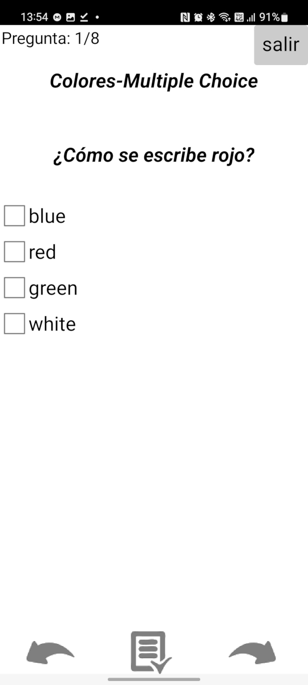

#Cuestionario

En la pantalla cuestionario 

Esta pantalla nos mostrará una a una las preguntas que tengamos cargadas en nuestro cuestionario. Arriba a la izquierda veremos una leyenda que nos indica en que pregunta estamos y cuantas preguntas tiene el cuestionario. A la misma altura a la derecha tenemos el boton salir, este botón nos permite avandonar el cuestionario si una evaluación y dejándonos en la plantalla de [seleccion de cuestionarios](cuestionarios.md). Debajo de esto encontramos el título del cuestionario. Debajo de esto se mostrará la pregunta y dependiendo si es el tipo de cuestionario es **W** o **MC** nos motrará o un campo de texto para ingresar la respues o varias opciones para seleccionar una de ellas.
Por ultimo en la parte inferior tenemos tres botones los que tiene flechas que apuntan a la izquierda o derecha nos permitirán ir navegando por el cuestionario. El botón del centro da por finalizado el cuestionario y evalúa las respuestas enviandonos a la plantalla de [estadísticas](estadisticas.md)