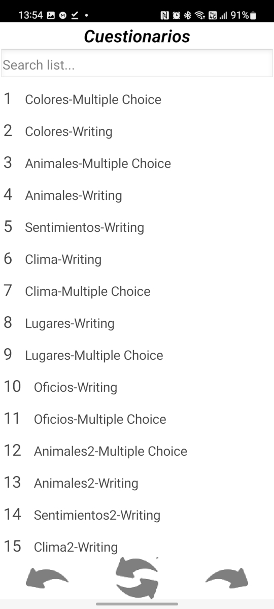

#Cuestionarios

En la pantalla Cuestionarios 

Veremos todos los cuestionarios que se tengan cargados en el archivo [cuestionarios.ods](index.md#cuestionarios). Esta pantalla nos permite seleccionar un cuestionario uuna vez que seleccionamos uno hacemos click en el boton de abajo a la derecha para continuar.
El botón de abajo a la izquiera nos permitira volver a la pantalla de perfil.
El botón del abajo en el centro nos permite actualizar la lista de cuestionarios. Esto permite que podamos cargar un nuevo cuestionario en nuestra planilla [cuestionarios.ods](index.md#cuestionarios) y mostrarlo apenas terminamos de configurarlo sin necesidad de reabrir la app.