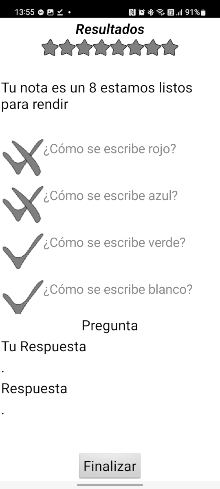

#Estadisticas

En la pantalla de estadísticas 

Veremos el resultado marcado con estrellas, los cuales van del 1 al 10. Ademas de esto una pequeña leyenda indicando cual es la nota obtenida y algún comentario que varia dependiendo de la nota. Debajo de esto vamos a ver una lista scrolleable que nos permite evaluar el resultado que se obtuvo en cada pregunta. Si se selecciona uno de los elementos de la lista en la siguiente sección veremos cual fue la respues que dimos y cual era la correcta. Por último hay un botón finalizar para volver a la pantalla de cuestionarios.

