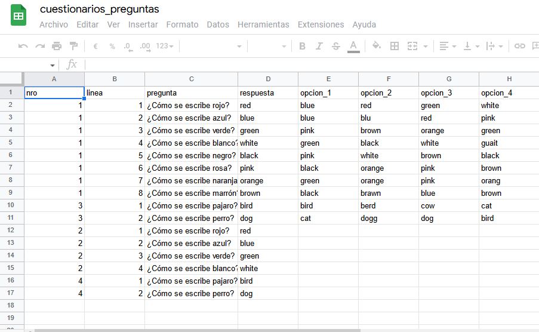

#Bienvenidos a AxP

AxP es un software de preguntas y respuestas. Actualmente soporta dos tipos de cuestionarios:

* Multiple opciones
* Escritura

##Multiple opciones

El usuario deberá contestar una pregunta teniendo como opciones para la respuesta entre 4 opciones

##Escritura

El usuario deberá contestar una pregunta sin opciones, debiendo escribir la respuesta correcta

#Prerrequisitos

Para poder hacer uso de AxP deberá importar los siguientes archivos

[cuestionarios.ods](Data/cuestionarios.odt)

[cuestionarios_preguntas.ods](Data/cuestionarios_preguntas.odt)

Una vez descargados deberan importarlos a su google drive. Estos dos archivos funcionan como base de datos para AxP. 
El archivo *cuestionarios.ods* contiene un listado de los cuestionarios disponibles. Tiene 3 columanas:

* **nro:** identifica de forma unica cada cuestionario. **No deben repetirse**
* **titulo:** Es el nombre del cuestionario
* **tipo:** El tipo del cuestionario. Los valores soportados actualmente son **W** donde el usuario debar escribir la respuestas sin opciones y **MC** para los cuestionarios de opción múltiples.

El archivo *cuestionarios_preguntas.ods* contiene las preguntas de los cuestionarios. Tiene 8 columans

* **nro: ** Este campo tiene el id del cuestionario. Si en el archivo  *cuestionarios.ods* cargamos un cuestionario cuyo id es 1. En este campo tenemos que cargar 1 si se quiere crear una pregunta para dicho cuestionario.
* **linea: ** es el numero de la pregunta 
* **pregunta: ** la pregunta que queremos hacer. 
* **respuesta: ** Aca se carga cual es la respuesta correcta. Ya sea que el cuestionarios es de tipo "W" o "MC" siempre se carga la cadena que representa la respuesta correcta. 
* **opcion_1: ** En el caso que el cuestionario sea de tipo "MC" se carga la primera opción. 
* **opcion_2: ** En el caso que el cuestionario sea de tipo "MC" se carga la segunda opción. 
* **opcion_3: ** En el caso que el cuestionario sea de tipo "MC" se carga la tercera opción. 
* **opcion_4: ** En el caso que el cuestionario sea de tipo "MC" se carga la cuarta opción.

**NOTA** : tener presente que para los cuestionario tipo "MC" el campo respuesta debería tener la cadena de algunos de los campos opcion_1, opcion_2, opcion_3 u opcion_4.

 Para importarlos pude arrastar desde el explorar de archivo a la pagina de google drive o subir archivo como se muestra en la siguiente imagen

Una vez que ambos archivos estan subidos hay que compartirlos. Para esto hay que hacer click en

Se abrirá una ventana donde le decimos como queremos compartir el archivo.

Seleccionamos la opción "Cualquier persona con el enlace" como se muestra en la imagen previa. Hacemos esto para los dos archivos.

Una vez que finalizamos el proceso de publicación de los archivos es hora de configurar AxP. Para esto en la ventana principal hacemos click en el botón opciones.

[Pantalla Configuración](configuracion.md)