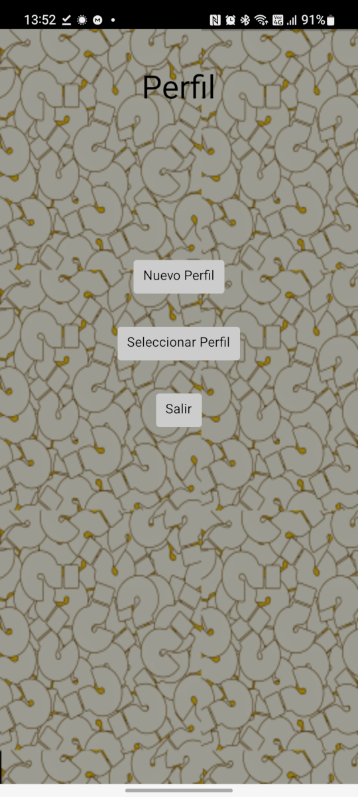

#Identificarse

En la pantalla perfil 

Veremos 4 botones:

* **[Identificarse]():** Accede a la pantalla que nos permite crear un nuevo perfil o seleccionar uno ya creado previamente. 
* **Configuración:** Accede a la pantalla de configuración de esta app. 
* **Ayuda:** Muestra esta ayuda.
* **Salir:** Cierra la app.

