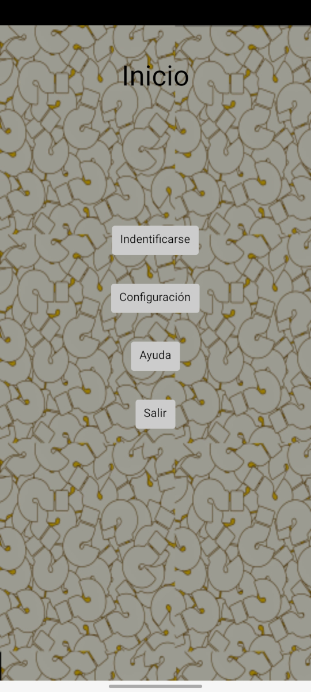

#Principal

En la pantalla principal 

Veremos 4 botones:

* **[Identificarse](identificarse.md):** Accede a la pantalla que nos permite crear un nuevo perfil o seleccionar uno ya creado previamente. 
* **[Configuración](configuracion.md):** Accede a la pantalla de configuración de esta app. 
* **Ayuda:** Muestra esta ayuda.
* **Salir:** Cierra la app.

